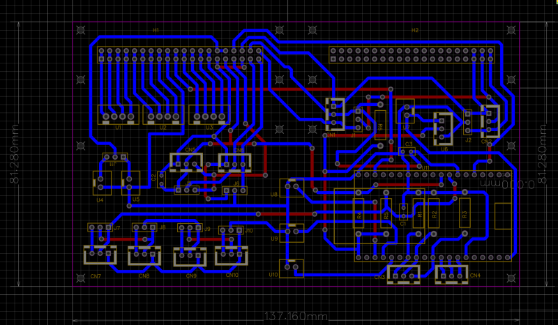
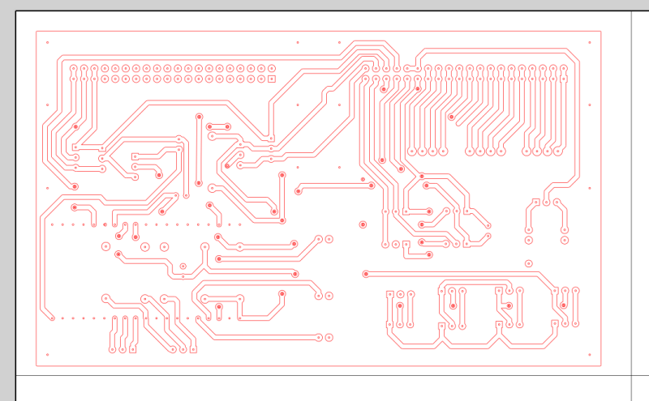

# EasyGcoder

An application for converting Gerber files received from EasyEDA into finished G-Code.

## Install

Prepare:

```
apt-get update
apt-get install build-essential git-core
```

To get source use git:

```
git clone <git_rep_uri>
```

Build:

```
cd ./easygcoder
```

Edit and save defaults in `.env` (see details [here](./env.md)) and then:

```
make test
make
make install
```

## Using

Make the work directory:

```
mkdir ~/workdir
cd ~/workdir
```

Initialize the work space:

```
easygcoder init
```

Finding the location of the main configuration file:

```
easygcoder -p
```

Use value of "Default config" parameter. For example, `/etc/easygcoder/easygcoder.conf` (it defined in `.env`)

Edit config:

```
sudo nano /etc/easygcoder/easygcoder.conf
```

the meaning of the parameters is similar to the file [.env](./env.md), But there are additional parameter. This parameter - `drill`.

You can specify tool change intervals. For example, if you only have two 1mm and 2mm drill bits, and their original Gerber file
contains a variety of holes ranging from 0mm to 4mm, you can immediately determine which holes you want to drill with which
tool (or perhaps you want to drill everything with a single drill).
This will correctly set tool change intervals in the resulting drilling file,
and the hole sorting will be more accurate, as it is performed first by drill diameter and only then by coordinates.

The format of the replacement interval setting parameter is:

```
drill=0.0 to 2.0 => 1  # Holes in the range from 0mm to 2mm will be replaced with one 1mm tool
drill=2.0 to 4.0 => 3  # Holes in the range from 2mm to 4mm will be replaced with one 3mm tool
...
```

Some notes on using input and output files. Depending on your goals and the composition of the input data,
you can either create a pure GCODE for milling only the tracks, add hole punching, mill the board outline,
or add a pin to the SVG (to make it easier to control the result).

Explore the contents of the `./convert.sh` file, which already contains the utility's basic usage methods.
Edit it to your liking, add salt and pepper... And then:

```
./convert.sh 5
```
5 - number of data batch in `./gerber` directory

Some images.

Source:



Mirrored by Y-axis:



")


This is all.
